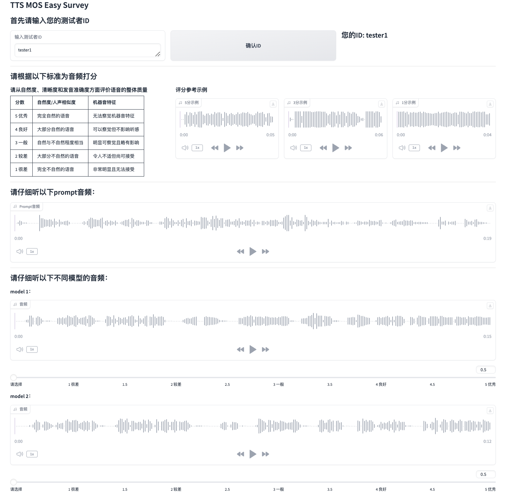

# TTS-MOS-Easy-Survey

[English](./readme_en.md) | 中文

一个基于Gradio的单文件简单易用 MOS (平均意见得分) 评测系统,适用于TTS（文本转语音），VC（语言转换）等模型评估。

## Demo


## 功能特点

- 单个代码文件
- 支持若干个 TTS 模型的音频质量和对比评测
- 支持不同模型音频间的响度平衡
- 支持0.5分一档的0~5分质量评分(app_dbfs.py)
- 支持1分一档的-3~3分对比评分(app_compare.py)
- 自动随机化音频播放顺序
- 防止重复提交评测
- 支持用户恢复上次评测进度(进度保存在`states/`目录下)
- 评分结果自动保存为 CSV 格式
- 简洁的网页界面

## 使用方法

1. 安装依赖：
```bash
pip install -r requirements.txt
```
2. 准备音频文件：
   - 在 `examples/prompt/` 目录下放置参考音频
   - 在 `examples/models_results/` 下为每个模型创建子文件夹，放入对应的合成音频，文件夹名称请与模型名称一致
   - 模型文件夹名称将被记录到result.csv中
   - 确保所有模型文件夹中的音频数量与参考音频相同
   - 确保所有文件夹内的音频文件命名顺序，系统会自动排序：1.wav, 2.wav, 3.wav, ...

3. 运行评测系统：
## 运行0~5分质量评分系统
```bash
python app_dbfs.py
```
## 运行-3~3分对比评分系统
```bash
python app_compare.py
```
4. 在浏览器中访问 `http://localhost:8565` 开始评测

## 评分标准 
### 质量评分
1-5分，0.5分一档
| 分数 | 自然度/人声相似度 | 机器音特征 |
|-------|---------------------|-------------|
| 5 优秀 | 完全自然的语音 | 无法察觉机器音特征 |
| 4 良好 | 大部分自然的语音 | 可以察觉但不影响听感 |
| 3 一般 | 自然与不自然程度相当 | 明显可察觉且略有影响 |
| 2 较差 | 大部分不自然的语音 | 令人不适但尚可接受 |
| 1 很差 | 完全不自然的语音 | 非常明显且无法接受 |

### 对比评分
-3~3分，1分一档
| 分数 | 描述 |
|-------|-------------|
| 3 | 明显优于参考音频 |
| 2 | 较优于参考音频 |
| 1 | 略优于参考音频 |
| 0 | 与参考音频相似 |
| -1 | 略差于参考音频 |
| -2 | 较差于参考音频 |
| -3 | 明显差于参考音频 |

## 结果保存

评测结果将保存在 `results/results.csv`

```csv
id,model,MOS1,MOS2,MOS3,...
aasda,fish,1,1.5,3
aasda,30w,2,4.5,3
aasda,100w,2.5,1,3
rer,fish,1,1.5,2
rer,30w,2.5,2,4.5
rer,100w,1.5,3.5,4
```

## Reference
- https://github.com/coqui-ai/TTS/discussions/482#discussioncomment-10772959